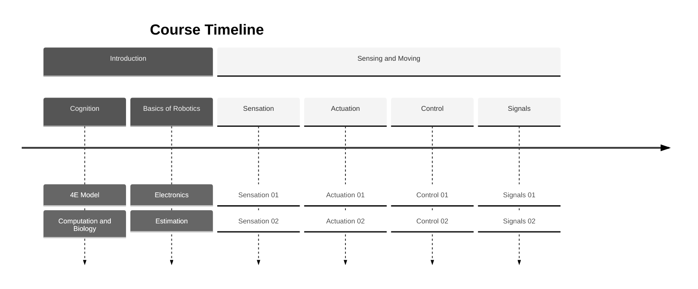
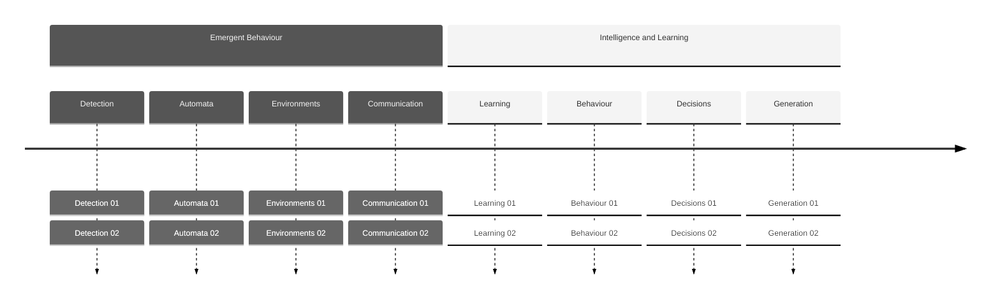

# COGS 300 Overview

### Overview
Are computational intelligences like biological intelligences?
Many things in nature make intelligent use of their environments.
Many things seem to perform computations and make decisions based off of signals and information.
In COGS 300, we consider the many forms of intelligence that exist in nature, and whether computational models can shed insight on how natural intelligence works.
We build physical robots to develop our intuitions about sensation, actuation, and decision-making.
We look at intelligence from a complex systems science perspective, weaving together agent and environment.
We learn about systems thinking, and the embedded, embodied, and extended approach to cognition.

### Approach
We use a very hands-on approach to learning. Be prepared to work creatively live during class.
The focus is on teaching practical skills by working through design problems. 
Before each lecture, you should prepare by going over the readings and pre-class videos.
During class time, we will do hands-on design exercises, participate in demonstrations, and listen to lectures that explain the connection between electrical components, algorithms, and biological intelligent systems. 
Assignments will be in the form of weekly design challenges will consist of hand-drawn and annotated solutions to design problems.
The final exam will also be a design challenge. 
To assist you in developing your design abilities, you will be required to maintain and hand in a physical sketchbook.
Labs will consist of building working robotic systems in groups.
Finally, we will hold a robot tournament where groups face off to complete an obstacle course for best time.

### Commitment
As a 4-credit upper-year UBC course, COGS 300 is designed to be a difficult but rewarding class. 
Many of you will go from only having taken a little bit of computer science, to building fully-working autonomous robots in a few short months.
You should expect to work extensively outside of class time building your robot.
You will learn mathematical and computational models, and apply them creatively to design problems.
You need to be prepared for active engagement with classmates and the teaching staff during lectures and labs.
You will experience the joy (and frustration) of bringing something electronic to "life." It's worth it!

### Why take the class?
There are a lot of good reasons to take COGS 300, even if you are not a COGS student.
1. Robot components pervade all parts of your modern life, from cars to computers to door codes. You will learn how your world has been built.
2. Artificial intelligence is now ubiquitous. You will learn the underpinnings of AI at an intuitive and practical level.
3. Computational models of intelligence are sometimes good and sometimes bad models of natural biological intelligence. You'll be able to discern good and bad claims about computation and intelligence.
4. It's fun. Making a robot is just plain fun.