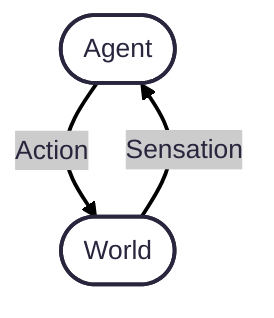

Sensation and actuation are two components of systems that need to act intelligently in the world. The most basic model of an intelligent agent and the world looks like this:

Although we try to make this model more complicated in COGS 300, it's a good starting point for this lab.

In this lab, you will learn how to use an Arduino to take a reading from a sensor, then output an action based on the reading. 

This never-ending interactive `loop` will be the basis of your robot programming for the rest of the term.

---
## Pre-lab

### 1. Review basic sensors

Review how [buttons](https://www.arduino.cc/en/Tutorial/Button), [potentiometers](https://docs.arduino.cc/learn/electronics/potentiometer-basics/), and [photoresistors](https://docs.arduino.cc/built-in-examples/analog/AnalogInput/) work in a real circuit. If you want even more in-depth explanations, you can also review Paul McWhorter's tutorials on [buttons](https://www.youtube.com/watch?v=Rg9WvA8ovik), [potentiometers](https://www.youtube.com/watch?v=PXf51k0alGU) and [photoresistors](https://www.youtube.com/watch?v=AEJ-j7EDyZ4).

Note that there are two paradigms at play here: [digital](https://docs.arduino.cc/language-reference/en/functions/digital-io/digitalread/) and [analog](https://www.arduino.cc/reference/tr/language/functions/analog-io/analogread/) sensing. Digital just means that we have forced the signal to be either `HIGH` or `LOW`, i.e., binary `1` or `0`, `+5V` or `0V`. Analog sensing means that we can vary the reading continuously between `HIGH` and `LOW`. Arduino happens to give us `1024` different levels of reading between `+5V` and `0V`, so it's not truly continuous, but is good enough for our purposes.

### 2. Review basic actuation

Review how [servos](https://docs.arduino.cc/tutorials/generic/basic-servo-control/) work.  Again, if you want an even more in-depth explanation, check out Paul McWhorter's tutorial on [servos](https://www.youtube.com/watch?v=mDyQkTIzDsc).

---
## Lab
