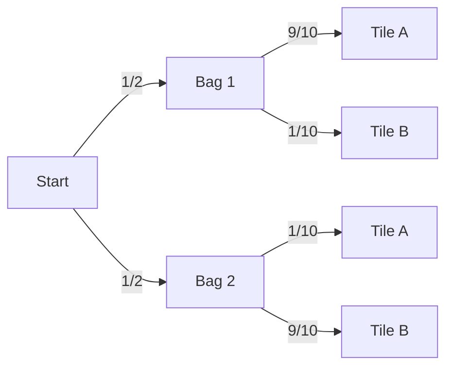

# Probability 101
## Introduction

This course uses only the very basic concepts of probability, but it can sometimes take some time to understand them. This lesson is an introduction to probability as used in robotics.

The fundamental thing to understand about probability is that you're always modelling the real world by using a mixture of countable things. People usually have some experience with games and gambling, so we often start with those fundamental models. In this activity, we will develop our own probability models so we can build up to Bayes next class.

### Materials
- Dice
- Coins
- Paper and pen

---
## Activity

In dice, you might choose a number you care about. For example, a simple bar gambling game is that you put bets on the table, everyone chooses a number, you roll a dice, and whoever gets their number gets all of the money. If you have six people playing, each has a different number. What's the probability that you win?

To figure that out, you divide the number of things you care about (just one) by the number of possible outcomes, including the one you care about (six).

$$
\text{outcomes for a die} = \{1, 2, 3, 4, 5, 6\}\\
\text{outcome I care about} = \text{dice comes up 6}\\
$$
$$
\frac{\text{No. of outcomes I care about}}{\text{No. of possible outcomes}} = \frac{1}{6}
$$

### Analyze and play your own one-die simple gambling game
Come up with a very simple gambling game that you can play with just one die and all the people at your table. If you have more than six, you might consider putting people into a team. Make it possible to win *something* within a round, even if you want to have a multi-round game.

Come up with an analysis strategy for each round. What's the probability that each person wins given the rules you have? Make it simpler if you're having a tough time with the analysis. Always do:

$$
P(A) = \frac{\text{No. of outcomes I care about}}{\text{No of. possible outcomes}}
$$

It doesn't have to be even for each player. For example, if I decide to make a game where you can "buy" numbers for $1/number, I could have up to five outcomes I care about, and my opponent could have only one (why five? because if I buy 6/6 numbers on the dice, I'd win every time but I'd only win my own money).

If you care about multiple mutually exclusive outcomes (either this or that happens), and they don't causally impact each other (like buying multiple numbers on the dice above), we call that the union of outcomes. Since we're just counting outcomes, you just add them up in "outcomes I care about."

$$
P(A \text{ or } B) = P(A) + P(B)
$$

In the buying numbers example where I buy 3 and 5:

$$
P(A) = P(\text{Die comes up 3}) = \frac{1}{6} \\[1em] 
\thickspace	
P(B) = P(\text{Die comes up 5}) = \frac{1}{6} \\[1em] 
\thickspace	
P(A \text{ or } B) = P(A) + P(B) = \frac{2}{6}
$$

Technically, you have to remove the probability that they happen together:

$$
P(A \text{ or } B) = P(A) + P(B) - P(A \text{ and } B)
$$

But for mutually-exclusive events, the $P(A \text{ and } B) = 0$, since they can't possibly happen at the same time. More below.

### Counting joint outcomes for independent events
Now, let's add in a second die. We can use the fancy-sounding [Fundamental Principle Of Counting](https://en.wikipedia.org/wiki/Rule_of_product) to analyze the possible outcomes. For two dice, there are exactly 36 possible outcomes for throwing them. Why? There are six outcomes for each, and $6 \times 6=36$. Let's see what it looks like:

$$
\text{outcomes for Die A} = \{1, 2, 3, 4, 5, 6\}\\
\text{outcomes for Die B} = \{1, 2, 3, 4, 5, 6\}\\

$$

$$
\text{outcomes for Dice (A, B)} \\=\\
    \begin{matrix}
    (1, 1) & (1, 2) & (1, 3) & (1, 4) & (1, 5) & (1, 6) \\
    (2, 1) & (2, 2) & (2, 3) & (2, 4) & (2, 5) & (2, 6) \\
    (3, 1) & (3, 2) & (3, 3) & (3, 4) & (3, 5) & (3, 6) \\
    (4, 1) & (4, 2) & (4, 3) & (4, 4) & (4, 5) & (4, 6) \\
    (5, 1) & (5, 2) & (5, 3) & (5, 4) & (5, 5) & (5, 6) \\
    (6, 1) & (6, 2) & (6, 3) & (6, 4) & (6, 5) & (6, 6) \\
    \end{matrix}
$$

We can read the above first row as being all the cases where $\text{Die A} = 1$ and $\text{Die B}$ can be every other possibility, the second line as all the cases where $\text{Die A} = 2$ and $\text{Die B}$ can be every other possibility, etc. Similarly, we can look at the first column as all the cases where $\text{Die B} = 1$ and  $\text{Die A}$ varies, etc.

Now, let's say that people at your table are now betting on *sums*, rather than the number that directly shows on the dice. What's the best number to bet on?

$$
\text{Sums for Dice (A, B)} \\=\\
    \begin{matrix}
    (1 + 1 = 2) & (1 + 2 = 3) & (1 + 3 = 4) & (1 + 4 = 5)  & (1 + 5 = 6)  & (1 + 6 = 7) \\
    (2 + 1 = 3) & (2 + 2 = 4) & (2 + 3 = 5) & (2 + 4 = 6)  & (2 + 5 = 7)  & (2 + 6 = 8) \\
    (3 + 1 = 4) & (3 + 2 = 5) & (3 + 3 = 6) & (3 + 4 = 7)  & (3 + 5 = 8)  & (3 + 6 = 9) \\
    (4 + 1 = 5) & (4 + 2 = 6) & (4 + 3 = 7) & (4 + 4 = 8)  & (4 + 5 = 9)  & (4 + 6 = 10) \\
    (5 + 1 = 6) & (5 + 2 = 7) & (5 + 3 = 8) & (5 + 4 = 9)  & (5 + 5 = 10) & (5 + 6 = 11) \\
    (6 + 1 = 7) & (6 + 2 = 8) & (6 + 3 = 9) & (6 + 4 = 10) & (6 + 5 = 11) & (6 + 6 = 12) \\
    \end{matrix}
    \\=\\
    \begin{matrix}
    2 & 3 & 4 & 5 & 6 & 7 \\
    3 & 4 & 5 & 6 & 7 & 8 \\
    4 & 5 & 6 & 7 & 8 & 9 \\
    5 & 6 & 7 & 8 & 9 & 10 \\
    6 & 7 & 8 & 9 & 10 & 11 \\
    7 & 8 & 9 & 10 & 11 & 12 \\
    \end{matrix}

$$

Looks like $7$ is the most frequent number. There are $\frac{6}{36}$ outcomes where $7$ is the sum, so that's the best bet. 

Note that it's easy to make a modeling mistake here. You could say that there are 11 possible outcomes (sum being 2 throuugh 12) and that the chance of getting a 7 is $\frac{1}{11}$. The key difference is that each outcome of a single die is equally-likely and does not impact the likelihood of the other dice showing a particular number. If you made a particular outcome more likely, like adding a weight to one side of the die, then the analysis would have to include numerical weight to simulate the physical weight.

There's another way to come to the same conclusion as the above. Let's say you wanted to model all the cases where the sum of the two dice was 3. You can count from the above table that this is $\frac{2}{36}$. You could have $\text{Die A} = 1$ and $\text{Die B} = 2$, or the reverse. The probability that $\text{Die A} = 1$ is $P(A) = \frac{6}{36} = \frac{1}{6}$. The probability that $\text{Die B} = 2$ is $P(B) = \frac{6}{36} = \frac{1}{6}$. The probability of joint independent events is:

$$
P(A \text{ and } B) = P(A) \times P(B)
$$

So, plugging in what we found from above:

$$
P(A=1, B=2) = \frac{1}{6} \times \frac{1}{6} = \frac{1}{36}
$$
$$
P(B=1, A=2) = \frac{1}{6} \times \frac{1}{6} = \frac{1}{36}
$$
$$
P(A=1 \text{ and } B=2) \text{ or } P(A=2 \text{ and } B=1) = 
$$
$$
P(A=1, B=2) + P(B=1, A=2) = \frac{1}{36} + \frac{1}{36} = \frac{2}{36}
$$

Which is what we could count from above.

### Make a two dice gambling game
Make a game of your own using two dice and analyze the outcomes. If you choose to analyze a dependent event (like the sums), make sure you include the analysis for the independent event (throwing the dice). You can re-use the matrices that we introduced above.

### Simulating Weights
Another classic way of introducing probability is a bag with stones. If we put a white and a black stone into a bag, you would have a $\frac{1}{2}$ chance of pulling either stone out: two stones in the bag, one outcome we care about in each case.

Let's say we wanted to simulate a six-sided dice with a bag. We could put a tile into the bag that corresponds to each number on the die. For example, $A=1, B=2...$ etc. As long as we put the same amount of tiles for each, the probability remains the same, e.g., 1 tile each of A-F will be the same probability as 10 tiles each of A-F. 

But if we wanted to weight the probability to draw a B, we could put more B tiles into the bag. You can prove that to yourself by playing with the extreme weighting situations, e.g., what if you put 1000 B tiles, and only one of each other one, clearly it would be much more likely to draw a B.

We're going to use this way of thinking to weight signals within a robotic context. Not today, but soon. Whenever you think about choices for a robot, think about it as tiles from one or more bags.

### Compound and Conditional Probabilities
Now that we have the bag idea in our heads, let's think about conditional probabilities. Conditional probabilities are used to analyze outcomes that partition the probability space, i.e., make it so that our outcomes are restricted to only certain cases.

Let's imagine we have two bags, `Bag 1` and `Bag 2`. If you put 9 A tiles and 1 B tile into `Bag 1`, and 9 B tiles and 1 A tile into `Bag 2`, you have a higher probability of getting a B tile from `Bag 2` than `Bag 1`. That's something we can know from the previous analysis, nothing new.

However, let's set up a situation where you are lacking some knowledge, which is super common in robotics. If I show you the bags, fill them as above, then hide them from you, then ask you to bet on either A or B, you would want to know which bag I drew from before you made your choice.

Without knowing anything, you could say there are two events: first, the bag choice, then second, the tile choice. There's a $\frac{1}{2}$ chance that `Bag 1` is picked. Then, if `Bag 1` is chosen, then a $\frac{9}{10}$ chance of choosing an A tile.

To figure out the conditional probability of an event, we can use the following formula:

$$
P(A|B) = \frac{P(A \text{ and } B)}{P(B)}, P(B) \ne 0
$$

You can derive this from the above via counting as well. You would read the above as the probability that A happened given B is equal to the probability that they both happened, divided by the probability that B happened. Why? Because you need to "reweight" by the frequency of B for the estimation of the outcomes. It's like zooming into just the B section of the probability space.

However, the formula for joint events changes if there's dependent between the variables. So, our above formula of $P(A \text{ and } B) = P(A) \times P(B)$ for *dependent* events is actually:

$$
P(A \text{ and } B) = P(A) \times P(B | A)
$$

This can look very circular with the definition of the conditional. The key is to identify what you know and don't know, and use the appropriate probability equation. We'll talk more about this when we get to Bayes.

---
## On your own
Next time, we'll be re-jigging the conditional probability formula above to become Bayes Theorem. It is a fundamental theory in probability and used across the scieneces, including in robotics. Typically, we want to estimate the state of a robot given sensor readings. 

The best way to practice probability is to set up models like we did above. Although it can seem funny to use gambling as a model, it's a very common way to get used to the symbols and ways of thinking about events that will help you when understanding other areas. 

To start to translate the gambling ideas into robotics, start to imagine the robot as driving from tile to tile, arranged out over a room. You could imagine big tiles or small tiles. Imagine first that the robot is the same size of the tiles, and moves fully from one tile to another. You could ask yourself the following questions:
- What's the probability that the robot is on any given tile?
- If I have a little bit of knowledge, like a sensor reading, how can I, say, colour, label, or bag the tiles and create a compound or conditional probability model?
- Does the probability change if I have a god-like knowledge of the robot vs. if I calculate the probability from the robot's perspective?

---
## Philosophical Connection
Probability is used so often in our culture that it can seem sometimes be shocking when low-probability events happen. These are called [black swan events](https://en.wikipedia.org/wiki/Black_swan_theory) by probability and cultural theorist Nicholas Taleb. For example, if there is a 33% chance that somebody gets elected, then people are often surprised when they do get elected. Even though the probability is low, 33% chance of being elected means that one out of every three elections, this person would expect to get elected. That's not an easy way to think.

Taleb argues that uncommon events are commmon, so to speak, and therefore we should expect the unexpected. He has also written a book called [Antifragile](https://en.wikipedia.org/wiki/Antifragile_(book)) to outline his idea that planning for chaos means that we need to design systems that improve when broken. Do you agree with this idea? Does it make sense to plan for the unexpected? Why or why not?