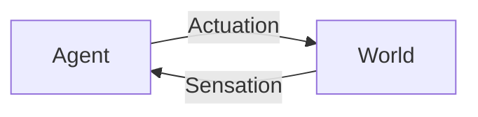
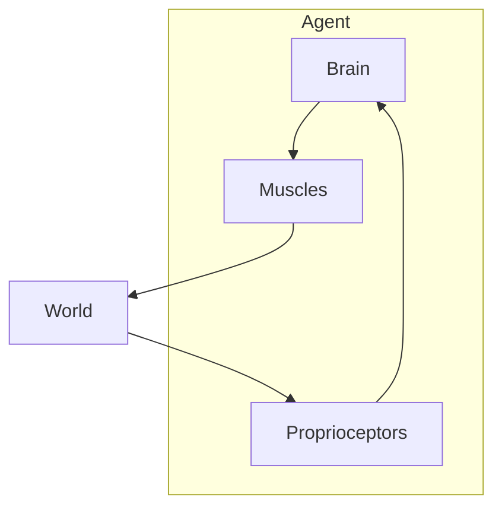

# Agent-world interactive loop
To start our discussion on intelligent agents, we have to create a boundary between that which is acting (the agent), and that which is acted upon (the world). Of course, our journey in this course will complicate the simple dichotomy between agent and environment, but for now, we want to learn the basic model so that we can challenge it later.

We can think of the agent acting on the world, then the world reacting in some way. The agent acts by changing the state of the world, and the world responds by changing the state of the agent.

There are a lot of problems with this simple model, but it illustrates the boundary between agent and world. However, we can already complicate the agent. For example, you have a brain and muscles to act on the world, and [proprioceptors](https://en.wikipedia.org/wiki/Proprioception) to sense the movement of those muscles.

This illustrates a concept in intelligent agent design: [subsumption architecture](https://en.wikipedia.org/wiki/Subsumption_architecture). That means that there is a higher-order layer (like your brain) that sends commands to a lower-order layer (like your muscles) which do the actual acting on the world, and send sensation messages back up to your brain. Different behaviour routines can happen simulateously on different independent modules: your muscles do not act serially one-at-a-time, but in parallel, independently of each other.

