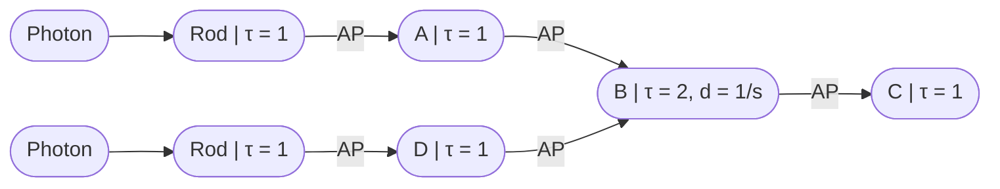

# Neuron Logic
Neurons are [complex biological cells](https://en.wikipedia.org/wiki/Biological_neuron_model), but they can be modelled mathematically as a [graph](https://en.wikipedia.org/wiki/Graph_theory). A common paradigm is to use a network diagram using thresholds for an action potential to propagate.

This is an incredibly simple model of a neuron. The reality is very complex, and beyond the scope of this course. But, it is a computational and mathematical model of a neuron, and it allows us to compare neurons, circuits, logic, and code.

Imagine that some neuron starts an action potential, such as a sensory neuron like the light detecting [rods](https://en.wikipedia.org/wiki/Rod_cell) or [cone](https://en.wikipedia.org/wiki/Cone_cell) cells in your eye. It will have a `threshold` for activation, i.e., some amount of light needs to hit it before it activates. Amazingly, your rods have a threshold of essentially `1` photon, whereas cones need `10`s to `100`s of photons to activate. The Greek Letter [tau](https://en.wikipedia.org/wiki/Tau) is used to indicate thresholds.

Each neuron can also have a threshold, which means that different activation patterns are possible.

This would simply pass the action potential signal along as soon as a photon hits the rod.

This would require two photons to hit the rod one after another to pass the signal along to `C`, because `B` has a threshold of `2`.  Here's another way the `C` could activate:

Of course, neuron activation takes place in **time**, and the amount of influence an action potential has on the next neuron firing decays due to the reuptake of [neurotransmitter](https://en.wikipedia.org/wiki/Neurotransmitter), among other things. So, if `B` has a decay equivalent to `1 / s` and `τ = 2`, either `2` photons would have to hit simultaneously, or `3` with a slight delay.

Finally, neurons have a refractory period, i.e., a time in which they are "resetting" and cannot be fired again, at an average of `2 ms`. Such a neuron would have a maximum firing rate of `500 hz`, that is, `500` times per second since `1000 ms / 2 ms = 500`.

Compare these to neural network neurons, which, although they have some functional similarities, actually operate on very differnt principles. We'll see more by the end of the course: they do have something that simulates thresholds (weights), and they do "activate" in the sense of passing along a signal, but they do not have the same time dynamics, refractory periods, or really any structural similarity except at a very high level. So the question is: are artificial neurons a good analog to human neurons? If so, how? If not, how? Stay tuned.